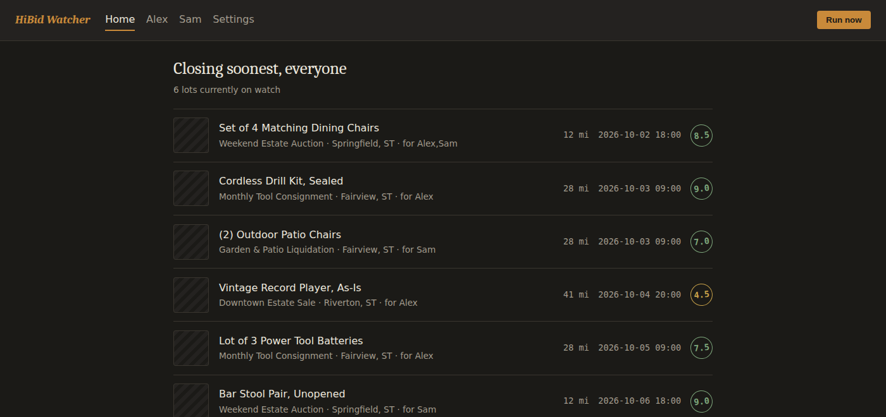

# HiBid Auction Watcher

A personalized auction-lot watcher for HiBid. Saves search terms per person, scores
incoming lots against what each person is actually looking for, and learns from
thumbs up/down feedback over time.

Self-hosted, runs in Docker, no accounts or auth — it's built for a single household
on a home network.

**Stack:** Python, FastAPI, SQLite, Jinja2, APScheduler, Docker.

Shared for portfolio purposes. No license is granted for reuse.

## Structure

```
hibid-watcher/
├── docker-compose.yml
├── README.md
└── hibid-app/
    ├── Dockerfile
    ├── requirements.txt
    ├── app.py           # FastAPI routes + scheduler wiring
    ├── db.py             # SQLite schema and queries
    ├── jobs.py           # Scrape-score-notify cycle, run on a schedule or on demand
    ├── scoring.py        # Rule-based + learned lot scoring
    ├── scraper.py        # HiBid GraphQL search
    ├── ha_webhook.py     # Home Assistant notification
    ├── static/
    │   └── style.css
    └── templates/
        ├── base.html
        ├── home.html
        ├── profile.html
        └── settings.html
```

## What it does

Several people ("profiles") each save their own search terms and get their own ranked
feed, scored against what they're actually looking for and refined by their own
thumbs up/down feedback over time. In the background, it searches HiBid's lot listings
on a schedule (default every 6 hours), scores every result, and fires a webhook to Home
Assistant on anything new — so a phone notification arrives instead of anyone having to
check the app.



Screenshot shown with placeholder data.

## How it works

- **Scraper** (`scraper.py`) — talks to HiBid's GraphQL endpoint directly rather than
  scraping the HTML pages, paginating through results for a search term within a given
  postal code and radius. Retries with backoff; a failed term is logged and skipped so
  one bad search never kills the scheduled run.
- **Scoring** (`scoring.py`) — two layers:
  - *Rule-based*: pulls a quantity out of the lot title (handles `set of 4`, `(3)`,
    `qty: 2`, `x4`, leading counts, and word forms like "pair"), scores how close that
    is to the target quantity, then nudges up or down on condition words such as
    "sealed" or "damaged". Works with zero feedback, so a brand-new profile still gets
    a sensible ranking.
  - *Learned*: per profile-and-term word weights built from thumbs up/down clicks.
    Starts at exactly zero effect and is deliberately clamped, so it tilts the
    rule-based score rather than overriding it. The rule layer is the floor.
- **Storage** (`db.py`) — SQLite. Profiles, search terms, seen lots, which lots matched
  which profile and term, feedback history, learned weights. Lots are stored once and
  shared across profiles; matches are per profile+term, so two people searching the
  same thing only cost one HTTP request.
- **Scheduler** (`app.py`, APScheduler) — runs the scrape-and-score cycle on an
  interval, plus a manual "Run now" that fires in the background so the request returns
  immediately.
- **Notifications** (`ha_webhook.py`) — posts new matches to a Home Assistant webhook.
  Degrades gracefully: with no webhook configured it logs what it would have sent, and a
  webhook failure never breaks a scrape run. Unsent matches are retried on the next run.

## Design decisions

A few choices worth calling out, since they were the actual engineering questions:

- **Why a rule-based floor under the learned scoring, instead of learning from scratch?**
  A brand-new profile has zero feedback, and a purely learned model has nothing to rank
  on until then. The rule-based layer (quantity match + condition words) gives every
  profile a sensible ranking on day one; the learned layer is deliberately capped
  (`MAX_LEARNED_ADJUSTMENT`) so it *tilts* that ranking as feedback accumulates rather
  than being able to override it outright. Cold-start behavior mattered more here than
  ranking sophistication.
- **Why GraphQL directly instead of scraping rendered pages?** HiBid's site is a
  single-page app backed by a GraphQL API; scraping rendered HTML would mean running a
  headless browser for every search. Reading the network tab to find the actual query
  is slower up front but avoids that entire dependency.
- **Why SQLite instead of a client-server DB?** Single-container, single-household,
  low write volume. Postgres would add an operational surface (a second service to
  run, back up, and keep in sync with the app version) with no corresponding benefit
  at this scale.
- **Why lots are stored once and matched per profile+term, instead of per profile?**
  Two people can save the same search term. Storing lots independently of who matched
  them means the scrape only costs one HTTP round-trip per unique term, no matter how
  many profiles are watching it.

## Configuration

The app takes all of its config from the environment — nothing hardcoded:

| Variable | Required | Default | What it does |
|---|---|---|---|
| `HIBID_ZIP` | yes | — | Search location. Canadian postal code or US ZIP. |
| `HIBID_MILES` | no | `100` | Search radius in miles. |
| `SCRAPE_INTERVAL_HOURS` | no | `6` | How often the background scrape runs. |
| `HA_WEBHOOK_URL` | no | blank | Home Assistant webhook for new-match alerts. Leave blank and the app logs what it would have sent. |
| `HOST_PORT` | no | `8002` | Host port the web UI is published on. |

A background image is also optional and off by default (`hibid-app/static/bg-photo.jpg`,
not included in this repo) — the CSS checks for the file and falls back to a flat color
if it's absent.

## Known limitations

These are deliberate, given it runs on a trusted home network:

- No authentication. Anyone who can reach the port can read and change every profile.
- No CSRF protection on the form POSTs.
- Scraping volume is low by design (a handful of terms, a few times a day) — this isn't
  built to hammer the endpoint.

Any of these would need solving before this were exposed to the internet.

**On the scheduler:** the in-app APScheduler loop handles re-running the scrape while the
container is up, but in practice I run this in short sessions rather than leaving it up
around the clock, so it hasn't been tested for 24/7 unattended uptime. Running it that way
would likely also want an external cron job (or a host-level scheduler / `systemd` timer)
to restart the container periodically as a safety net, independent of the in-process
scheduler — that's not set up yet.

## How this was built

I designed the architecture, data model, and scoring approach, and directed an AI coding
assistant through implementation. The schema, the two-layer scoring design, the scraper
approach, and the separation between scraping / scoring / notification / serving were my
decisions; I iterated with AI on the code implementing them, then tested and adjusted it
by hand.

## Planned

- eBay API integration alongside HiBid, so the feed isn't locked to one marketplace
- A deployed instance (exploring Azure)
- A real auth layer if this ever leaves the household network